# PraisonAI WordPress Plugin

Add an AI chatbot to your WordPress site in minutes.

```mermaid
graph LR
    A[🌐 WordPress] --> B[🔌 PraisonAI Plugin]
    B --> C[🤖 OpenAI API]
    C --> D[💬 Chat Response]
    
    style A fill:#6366F1,stroke:#7C90A0,color:#fff
    style B fill:#8B0000,stroke:#7C90A0,color:#fff
    style C fill:#F59E0B,stroke:#7C90A0,color:#fff
    style D fill:#10B981,stroke:#7C90A0,color:#fff
```

## Quick Start

1. **Install** → Upload the plugin to WordPress
2. **Configure** → Add your OpenAI API key
3. **Add** → Use `[praisonai_chat]` shortcode

That's it! 🎉

## Features

| Feature | Description |
|---------|-------------|
| 🤖 AI Chat | GPT-powered responses |
| 🔐 Secure | API key stored safely |
| 📱 Responsive | Works on all devices |
| ⚡ Fast | Scripts load only when needed |

## Documentation

Full documentation is available at [mervinpraison.github.io/PraisonAIWP-Plugin](https://mervinpraison.github.io/PraisonAIWP-Plugin/)

- [Installation Guide](docs/getting-started/installation.md)
- [Configuration](docs/getting-started/configuration.md)
- [Add Chatbot](docs/features/shortcode.md)
