# API Settings

Manage your OpenAI connection.

## Access Settings

**Settings → PraisonAI**

## Settings Page

| Field | Purpose |
|-------|---------|
| OpenAI API Key | Your secret key from OpenAI |
| Show/Hide Button | Toggle key visibility |

## Security

```mermaid
graph TB
    A[🔑 Your API Key]
    A --> B[🔒 WordPress Database]
    B --> C[🛡️ Never Exposed]
    
    style A fill:#6366F1,stroke:#7C90A0,color:#fff
    style B fill:#F59E0B,stroke:#7C90A0,color:#fff
    style C fill:#10B981,stroke:#7C90A0,color:#fff
```

Your key is:

- ✅ Stored in WordPress database
- ✅ Never shown in page source
- ✅ Only used server-side
- ✅ Protected by WordPress nonces

## Model Used

The plugin uses **GPT-3.5 Turbo** for fast, affordable responses.

## API Costs

OpenAI charges per token. Typical costs:

| Usage | Approximate Cost |
|-------|------------------|
| 100 questions/day | ~$1-3/month |
| 500 questions/day | ~$5-15/month |

[Check OpenAI pricing →](https://openai.com/pricing)
