# Chatbot

An AI assistant on your website.

```mermaid
graph LR
    A[👤 Visitor] --> B[💬 Question]
    B --> C[🤖 AI]
    C --> D[📝 Answer]
    D --> A
    
    style A fill:#6366F1,stroke:#7C90A0,color:#fff
    style B fill:#F59E0B,stroke:#7C90A0,color:#fff
    style C fill:#8B0000,stroke:#7C90A0,color:#fff
    style D fill:#10B981,stroke:#7C90A0,color:#fff
```



## What It Does

| Feature | Benefit |
|---------|---------|
| Instant Replies | No waiting for human response |
| 24/7 Available | Works while you sleep |
| Smart Answers | Powered by GPT-3.5 |
| Clean Design | Fits any theme |

## How It Looks

The chatbox appears where you add the shortcode:

- Clean input field
- Send button
- Chat history above

## How It Works


## Quick Add

```
[praisonai_chat]
```

[Learn more about shortcodes →](shortcode.md)
