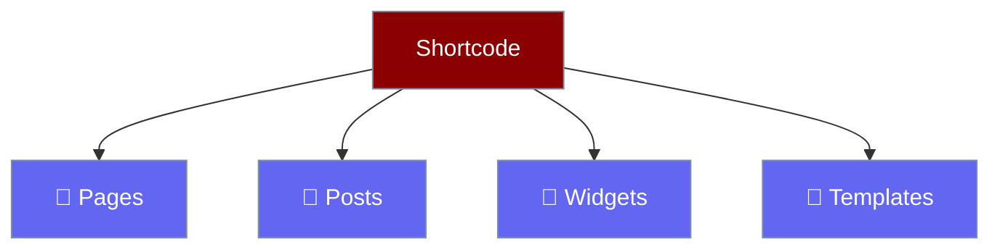

# Shortcode

Add the chatbot anywhere with one line.


## The Shortcode

```
[praisonai_chat]
```

That's all you need!

## Where To Add It



| Location | How |
|----------|-----|
| **Page** | Edit page → Add shortcode block |
| **Post** | Edit post → Add shortcode block |
| **Widget** | Appearance → Widgets → Add shortcode |
| **Template** | Use `<?php echo do_shortcode('[praisonai_chat]'); ?>` |

## Example

### In the Block Editor (Gutenberg)

1. Click **+** to add block
2. Search "Shortcode"
3. Paste `[praisonai_chat]`
4. Publish!

### In Classic Editor

Just paste the shortcode in the content area.

## Smart Loading

Scripts only load on pages with the shortcode. Your other pages stay fast! ⚡
