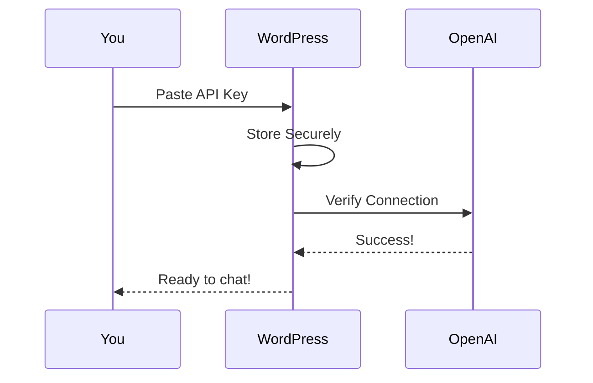

# Configuration

Connect your OpenAI API key.

## Step 1: Get Your API Key

1. Go to [OpenAI Platform](https://platform.openai.com/api-keys)
2. Click **Create new secret key**
3. Copy the key (starts with `sk-...`)

!!! warning "Keep it Secret"
    Never share your API key publicly.

## Step 2: Add to WordPress

1. Go to **Settings → PraisonAI**
2. Paste your API key
3. Click **Save Changes**

## Done!

Your chatbot is ready. [Add it to a page →](../features/shortcode.md)
