# Customization

Style the chatbot to match your brand.

```mermaid
graph LR
    A[🎨 CSS] --> B[💬 Chatbot]
    B --> C[✨ Your Style]
    
    style A fill:#6366F1,stroke:#7C90A0,color:#fff
    style B fill:#F59E0B,stroke:#7C90A0,color:#fff
    style C fill:#10B981,stroke:#7C90A0,color:#fff
```



## CSS Classes

| Class | Element |
|-------|---------|
| `.praisonai-chat-container` | Main wrapper |
| `.praisonai-chat-history` | Message area |
| `.praisonai-chat-form` | Input form |
| `#praisonai-chat-input` | Text input |
| `#praisonai-chat-submit` | Send button |

## Example: Custom Colors

Add to your theme's CSS or Customizer:

```css
/* Container */
.praisonai-chat-container {
    background: #f5f5f5;
    border-radius: 10px;
    padding: 20px;
}

/* Send button */
#praisonai-chat-submit {
    background: #8B0000;
    color: white;
    border-radius: 5px;
}

/* Input field */
#praisonai-chat-input {
    border: 2px solid #ddd;
    border-radius: 5px;
}
```

## Example: Full Width

```css
.praisonai-chat-container {
    max-width: 100%;
    width: 100%;
}
```

## Quick Tips

- 🎨 Use your brand colors
- 📱 Test on mobile
- 👁️ Ensure readable contrast
