# Troubleshooting

Common issues and quick fixes.

```mermaid
graph TB
    P[🔴 Problem]
    P --> C1{API Key?}
    P --> C2{Shortcode?}
    P --> C3{JavaScript?}
    
    C1 --> S1[✅ Re-enter key]
    C2 --> S2[✅ Check spelling]
    C3 --> S3[✅ Check conflicts]
    
    style P fill:#8B0000,stroke:#7C90A0,color:#fff
    style C1 fill:#F59E0B,stroke:#7C90A0,color:#fff
    style C2 fill:#F59E0B,stroke:#7C90A0,color:#fff
    style C3 fill:#F59E0B,stroke:#7C90A0,color:#fff
    style S1 fill:#10B981,stroke:#7C90A0,color:#fff
    style S2 fill:#10B981,stroke:#7C90A0,color:#fff
    style S3 fill:#10B981,stroke:#7C90A0,color:#fff
```

## Issue: "API key is not set"

**Cause:** Missing or invalid API key

**Fix:**
1. Go to **Settings → PraisonAI**
2. Re-enter your API key
3. Click **Save Changes**

## Issue: Chatbot Not Showing

**Cause:** Shortcode not added correctly

**Fix:**
1. Check exact spelling: `[praisonai_chat]`
2. Remove extra spaces
3. Use Shortcode block (not paragraph)

## Issue: No Response

**Cause:** API connection issue

**Fix:**
1. Check your OpenAI account has credits
2. Verify API key is correct
3. Try again in a few minutes

## Issue: JavaScript Error

**Cause:** Plugin conflict

**Fix:**
1. Disable other plugins temporarily
2. Test chatbot
3. Re-enable plugins one by one
4. Find the conflicting plugin

## Still Stuck?

1. Check browser console (F12 → Console)
2. Enable `WP_DEBUG` in wp-config.php
3. [Open an issue on GitHub](https://github.com/MervinPraison/PraisonAIWP-Plugin/issues)
